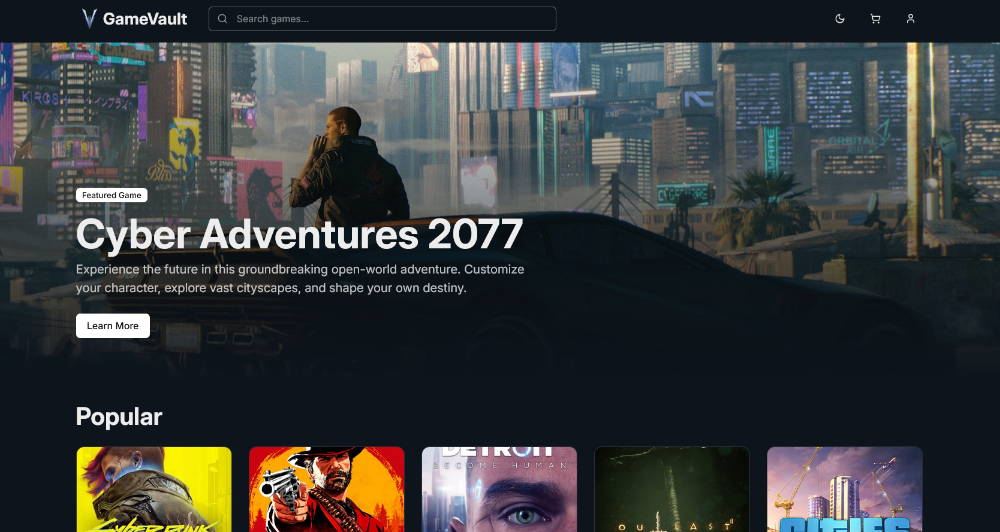
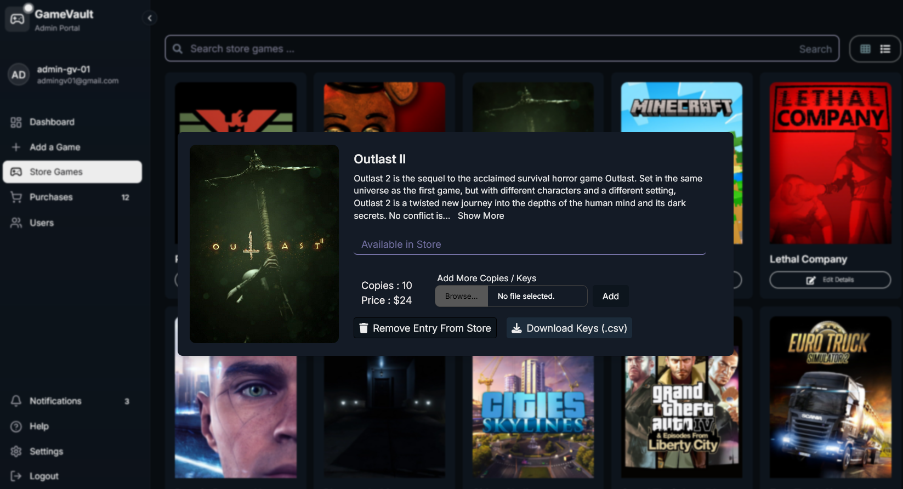

# GameVault: A Digital Marketplace and Top-Up Store





## Documentation & Resources

- **API** - API Documentation
[PostMan API Documentation](https://documenter.getpostman.com/view/39145685/2sAYX9o1aE)

- **ShadeCN** - A set of beautifully-designed, accessible components and a code distribution platform.:  
[Shadecn](https://ui.shadcn.com/)

- **Tailwind CSS** - A utility-first CSS framework for rapidly building modern websites:
[TailwindCSS](https://tailwindcss.com/)

- **Font Awesome** - Icon library used for design elements:  
[Font Awesome](https://fontawesome.com/)

- **IGDB** - Database API for fetching Game Data:
[IGDB](https://www.igdb.com/api)


## Description
**GameVault** is a web-based platform where users can purchase video games, top-up in-game currencies, and explore game details. The platform integrates external APIs (like Steam and RAWG) to fetch game data while utilizing a custom backend for user management, transactions, and digital purchases.

## Scope
GameVault is a digital marketplace and top-up store for gamers, providing seamless access to game purchases and in-game currency. It consists of two core modules:
- **Marketplace Module**: Allows users to browse, purchase, and review video games.
- **Top-Up Module**: Enables users to buy in-game currency and digital codes for various platforms.

## Tech Stack
- **Backend**: Express, MongoDB, NodeJS
- **Frontend**: React, Vite, JavaScript, Chakra UI, Tailwind CSS

## Features
### User
- Browse and purchase games from a variety of platforms
- Top-up in-game currencies and digital codes
- User authentication and transaction history
- Game reviews and ratings
- Seamless integration with external APIs (Steam, RAWG)
### Admin(s)
- Add Games to Store
- View Purchases & Ratings
- Customer Support 

## Installation

### 1. Clone the repository

```bash
git clone <repository-url>
cd GameVault
```

### 2. Backend Setup

- Go to the `Express-Backend` folder

```bash
cd Express-Backend
```

- Install dependencies

```bash
npm install
```

- Set up environment variables (e.g., API keys, MongoDB connection string, contact @mariathv in case of any issue)

- Start the backend server

```bash
node app.js
```

### 3. Frontend Setup

- Go to the `React-Frontend` folder

```bash
cd React-Frontend
```

- Install dependencies

```bash
npm install
```

- Start the frontend development server

```bash
npm run dev
```

The web application will be running at `http://localhost:5173`.


## Collaborators
<!-- readme: contributors -start -->
<table>
	<tbody>
		<tr>
            <td align="center">
                <a href="https://github.com/mariathv">
                    
                    <br />
                    <sub><b>Maria Naeem Khokhar</b></sub>
                </a>
            </td>
            <td align="center">
                <a href="https://github.com/amanasif01">
                    
                    <br />
                    <sub><b>amanasif01</b></sub>
                </a>
            </td>
            <td align="center">
                <a href="https://github.com/Ammarsyed04">
                    
                    <br />
                    <sub><b>Ammarsyed04</b></sub>
                </a>
            </td>
		</tr>
	<tbody>
</table>
<!-- readme: contributors -end -->

## License

This project is licensed under the MIT License.


